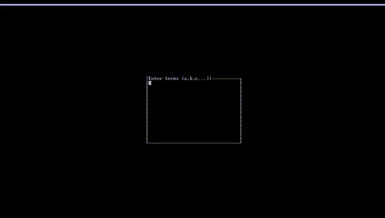

# Quine-McCluskey Solver

Receives any number of minterms with a maximum of 64 bits. Generates the reduced Boolean equation using Quine-McCluskey algorithm for implicants and Petrick's method for prime implicants. Display the tables, chart, equation and digital circuit.


## Screenshots




## Requirements

- ncurses


## Building
Clone the project
```bash
  git clone https://github.com/blr-ophon/logicMinimizer
```
Compile using:

```bash
  cd logicMinimizer
  make
```
## Running

Run the executable directly or use make:

```bash
  make run
```


## Usage

Provide minterms separated by commas
Ex.: 1,12,22,30
